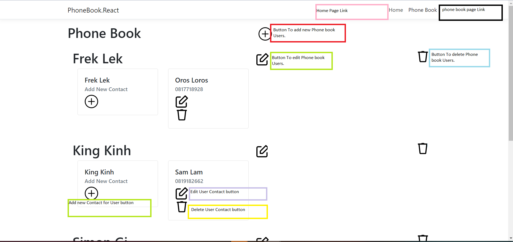

# 
# WebApp
<table>
<tr>
<td>
  A webapp showing a phone book example using ReactJS with .netCore 5.0
</td>
</tr>
</table>

## Site

### Phone Book User Page
THis is the page in which a user gets added.

### Phone Book User Contacts

## Built with 

- [.NetCore](https://dotnet.microsoft.com/learn/aspnet/what-is-aspnet-core) - .NET is a free and open-source, managed computer software framework for Windows, Linux, and macOS operating systems.
- [ReactJs](https://reactjs.org/) - React – A JavaScript library for building user interfaces
- [Bootstrap](http://getbootstrap.com/) - Extensive list of components and  Bundled Javascript plugins.
- [SQLite](https://www.sqlitetutorial.net/) - SQLite Show Tables: Listing All Tables in a Database. 

